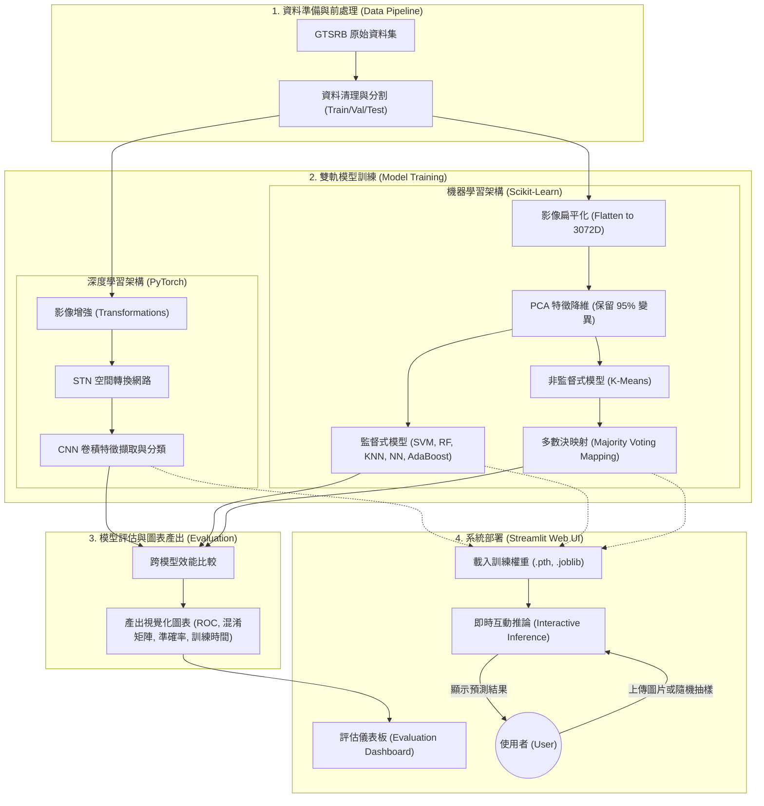

# 🚦 GTSRB 交通號誌辨識系統

 

本專案實作一個基於 **GTSRB (German Traffic Sign Recognition Benchmark)** 資料集的交通號誌辨識系統。
系統比較了深度學習模型 (**CNN 搭配空間轉換網路 STN**) 與多種機器學習模型 (**NN, SVM, Random Forest, KNN, AdaBoost, K-means**) 在特徵降維 (**PCA**) 後的分類表現與訓練時間。

**[前往 Streamlit Demo 網站](https://vision-hw02-gtsrb-cnn.streamlit.app)**

---

## 💠 **研究架構（Research Framework）：CRISP-DM** 

### 1. 商業理解與環境建置 (Business Understanding & Setup)
本專案建立一個能自動辨識德國交通號誌的深度學習模型，目標是精確地分類 43 種不同的德國交通號誌，高準確率的交通號誌辨識對自動駕駛系統至關重要。
此專案也作為學術探索，比較深度學習模型 (CNN+STN) 與傳統機器學習流程 (PCA + 分類器) 的差異與優劣。

### 2. 資料理解與準備 (Data Understanding & Preparation)
- **資料集:** [Kaggle GTSRB Dataset](https://www.kaggle.com/datasets/meowmeowmeowmeowmeow/gtsrb-german-traffic-sign)
- **資料準備:** 
  影像在送入模型前，統一調整大小為 `32x32` 像素並進行正規化 (Normalization)。我們實作了 PyTorch 的 `Dataset` 與 `DataLoader` 來處理資料集批次讀取，並將訓練集 (`Train.csv`) 以 80/20 的比例切分為 Train 與 Validation (使用 `sklearn` 的 `stratify` 分層抽樣)。

### 3. 模型建置 (Modeling)
我們開發了兩條主要的建模流程：
1. **深度學習 (CNN + STN):**
   - 實作於 `src/model.py`。
   - 結合了 Spatial Transformer Network (STN) 模組，讓模型能自動學習並校正影像的空間變換。
   - 訓練過程會自動記錄每個 Epoch 的 Loss/Acc 歷史及總訓練時間。
2. **機器學習 (PCA + ML):**
   - 將影像打平為 3072 維度的特徵向量，並使用 PCA 進行降維，保留 95% 的變異數。
   - 訓練模型包含: NN (MLP), SVM, Random Forest, KNN, AdaBoost, K-Means。

### 4. 模型評估 (Evaluation)
要產生跨模型的比較圖表 (包含準確率比較、ROC 曲線、CNN 混淆矩陣、Loss 曲線、訓練時間比較以及 PCA Scree Plot)，請執行評估腳本。所有視覺化圖表將自動儲存至 `reports/figures/` 目錄中。圖表包含漸層色彩，並將 K-means 透過「多數決映射」納入準確率比較。

### 5. 系統部署 (Deployment with Streamlit)
我們透過 Streamlit 建立了一個互動式的 Web 應用程式 (`gtsrb.py`)，採用極致的四分頁展示佈局：
- **🚥 GTSRB 交通號誌辨識 (tab1)**: 提供「隨機抽樣」與「本機圖片上傳」功能，可即時觀看多個模型的分類結果。
- **📊 初始評估指標 (Original) (tab2)**: 讀取 `1st_backup/` 呈現第一階段基準模型 (Baseline) 的 6 大效能圖表。
- **🔆 優化評估指標 (Optimized) (tab3)**: 讀取 `2nd_backup/` 呈現導入 BatchNorm2d 與 Data Augment 優化後的 6 大效能圖表，AUC 達 1.0000。
- **⛳ 系統優化與驗收說明 (tab4)**: 整合 `walkthrough.md` 即時渲染，提供一站式學術驗收面板。

---

## ✨ **核心研究亮點（Core Research Highlights）**
- **STN 空間轉換網路**：透過 PyTorch 實作 STN，增強 CNN 對交通號誌平移與縮放的抗性。
- **跨模型基準比較**：全面對比 CNN 與傳統 ML (包含 NN/MLP, SVM, RF, KNN, AdaBoost, K-means) 在高維影像特徵上的表現差異。
- **多數決映射 (Majority Voting Mapping)**：針對非監督式的 K-means 模型實作映射邏輯，使其能與監督式模型在同一個基準線上計算準確率。
- **即時互動推論**：透過 Streamlit 實作 Web UI，支援隨機抽樣與本機圖片上傳，即時展示多個模型的推論結果。

---

## 🏛️ **系統架構圖（System Architecture Diagram）**



## 📁 **專案檔案結構（Project Files Structure）**
```text
GTSRB_CNN/
├── data/                   # 資料集目錄 (raw/, extracted/)
├── models/                 # 訓練好的模型權重 (.pth, .joblib)
├── reports/                # 評估報告與視覺化圖表
│   ├── figures/            # 跨模型比較圖表
│   ├── training_history.csv
│   └── training_times.json
├── src/                    # 核心程式碼
│   ├── dataset.py          # PyTorch 資料集與 DataLoader
│   ├── model.py            # CNN + STN 模型定義
│   ├── train_cnn.py        # 深度學習訓練腳本
│   ├── train_ml.py         # 機器學習訓練腳本 (含 PCA)
│   └── evaluate.py         # 模型評估與圖表生成腳本
├── gtsrb.py                # Streamlit Web UI 主程式
├── requirements.txt        # 依賴套件清單
├── README.md               # 專案說明文件
├── HW2_Report.md           # 完整作業報告
└── CHANGELOG.md            # 版本更新日誌
```

---

## 🛠️ **技術棧（Tech Stack）**
- **程式語言**: `Python 3.10+`
- **深度學習**: `PyTorch`, `torchvision`
- **機器學習**: `scikit-learn`
- **資料處理與視覺化**: `pandas`, `matplotlib`, `seaborn`, `joblib`
- **前端部署**: `Streamlit`

---

## 🚀 **安裝與執行（Installation and Execution）**

### 1. 環境準備

建議使用 `conda` 或 `venv` 建立一個獨立的 Python 虛擬環境。

```bash
# 例如，使用 venv
python -m venv Vision_HW_02
source Vision_HW_02/bin/activate  # On Windows, use `.venv\Scripts\activate`

# 或是，使用 virtualenvwrapper 建立環境
mkvirtualenv Vision_HW_02
workon Vision_HW_02
```

### 2. 安裝相依套件

```bash
pip install -r requirements.txt
```

### 3. 執行模型訓練

- **CNN 深度學習模型 (含 STN)**
  ```bash
  python src/train_cnn.py
  ```

- **傳統機器學習模型 (含 PCA)**
  ```bash
  python src/train_ml.py
  ```

### 4. 執行模型評估與產出圖表

```bash
python src/evaluate.py
```

### 5. 啟動 Streamlit 互動介面

```bash
streamlit run gtsrb.py
```

---

## ☁️ **部署至 Streamlit Cloud（Deploy to Streamlit Cloud）**

在將此專案推送到您的遠端 GitHub 儲存庫後，您可以依照以下步驟將其免費部署為一個公開的 Web 應用程式：

1.  **登入 Streamlit Community Cloud**
    前往 [share.streamlit.io](https://share.streamlit.io/) 並使用您的 GitHub 帳號登入。

2.  **建立新應用程式**
    點擊頁面右上方的「New app」按鈕。

3.  **連結您的儲存庫**
    - **Repository**: 選擇您存放此專案的 GitHub 儲存庫。
    - **Branch**: 選擇您要部署的分支（例如 `main` 或 `master`）。
    - **Main file path**: 確認應用程式的主檔案路徑為 `gtsrb.py`。

4.  **部署**
    點擊「Deploy」。
    Streamlit 將會開始建置您的應用程式，這可能需要幾分鐘的時間。

5.  **取得應用程式網址**
    部署成功後，您會得到一個公開的網址。
    請使用此網址更新本文件最上方的「前往 Streamlit Demo 網站」連結。

## 📝 **授權聲明與致謝 (Licensing and Acknowledgments)**
* 本研究專案僅供國立中興大學碩士學位 - 人機互動與電腦視覺課程作業研究之目的使用。
* 指導教授：國立中興大學 凃瀞珽 教授。
* 詳細的更新歷史紀錄，請參閱 [CHANGELOG.md](./CHANGELOG.md)。
* 最後更新：2026-05-20 (v1.2.0)